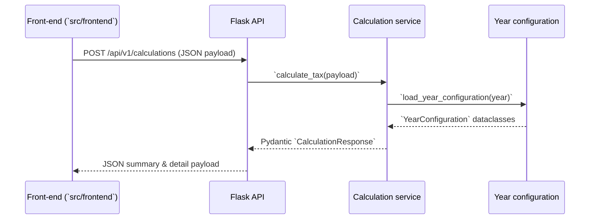

# Architecture Overview

GreekTax is split into an API service that performs all business logic and a
static front-end that consumes the published endpoints. Both surfaces rely on
shared configuration and localisation assets so changes propagate consistently
across deployments.

## Deployment Topology

| Environment | Hosted Components | Notes |
| --- | --- | --- |
| Local development | Flask API (`src/greektax/backend`) and static shell (`src/frontend`) served from the same process via [`create_app`](../src/greektax/backend/app/__init__.py). | `flask --app greektax.backend.app` enables hot reloads and local asset serving. |
| Staging | Flask API behind a WSGI server (e.g., Gunicorn) with the static build deployed to object storage. | Builds consume the same configuration snapshots committed to the repo so parity issues surface early. |
| Production | Managed WSGI host for the API and CDN-backed static assets. | Reverse proxies terminate TLS, forward `/api/*` to the Flask service, and cache `/assets/*` aggressively. |

```
                ┌──────────────────────┐
                │      CDN / S3        │
                │  (static frontend)   │
                └──────────┬───────────┘
                           │
        Browser ───────────┼────────────> Flask API / WSGI ──> Calculation service
                           │                                  (`services/calculation_service.py`)
                           ▼
                 Locale & configuration assets (`src/greektax`)
```

## Module Boundaries

### Backend service (`src/greektax/backend`)

The Flask application exposes calculation, configuration, and localisation
routes through dedicated blueprints that are registered during start-up.
[`register_routes`](../src/greektax/backend/app/routes/__init__.py) wires the
calculations, configuration, and translation handlers into the app, while
[`create_app`](../src/greektax/backend/app/__init__.py) configures CORS and
serves the prototype UI during local development.

Key responsibilities include:

- Loading translation catalogues from the shared resources and serving them to
  clients, ensuring the API and UI draw from the same phrase set.
  [`load_translations`](../src/greektax/backend/app/localization/catalog.py)
  normalises locale requests, loads the JSON payloads, and returns the active and
  fallback bundles as a single response.
- Exposing configuration metadata for each supported filing year by parsing the
  structured YAML definitions. The `/api/v1/config` endpoints serialise the
  strongly typed configuration objects into JSON for the front-end.
  [`list_years`](../src/greektax/backend/app/routes/config.py) surfaces the
  available years along with their metadata so the UI can drive drop-downs and
  defaults.
- Performing income, deduction, and contribution calculations via the
  calculation service module, which accepts validated payloads from the public
  API and returns bilingual breakdowns for every income stream.

The API service is deployed separately from the static UI. Production
installations front the Flask app with a WSGI server, while local development can
run `flask --app greektax.backend.app` to host the endpoints.

| Module | Primary owner | Responsibilities |
| --- | --- | --- |
| `app/routes/*` | API surface | HTTP endpoints, payload parsing, and error handling. |
| `services/calculation_service.py` | Calculation orchestration | Validates requests, merges configuration toggles, and coordinates category calculators. |
| `config/year_config.py` | Configuration loader | Parses year YAML files, validates structure, and exposes helper dataclasses. |
| `app/models/api.py` | API contract | Defines the Pydantic request/response models used for validation. |
| `app/models/__init__.py` | Normalised domain models | Converts the API payload into calculator-friendly structures. |

### Front-end shell (`src/frontend`)

The front-end is a static build served from object storage, a CDN, or Flask's
static routes during development. [`index.html`](../src/frontend/index.html)
bootstraps the calculator with the embedded translation bundle, while
[`assets/scripts/main.js`](../src/frontend/assets/scripts/main.js) configures the
API base URL and performs all JSON fetches. By default the script points to the
hosted API on PythonAnywhere but falls back to same-origin endpoints when served
from the Flask app, keeping the deployment workflow decoupled from the UI code.

## Centralised Translation Management

Translations live in locale-specific JSON files under
[`src/greektax/translations`](../src/greektax/translations). Each file contains
`backend` and `frontend` sections that the API service and the static bundle can
consume. The embedding script
[`scripts/embed_translations.py`](../scripts/embed_translations.py) reads every
locale, extracts the `frontend` entries, and writes them into
`assets/scripts/translations.generated.js` so the browser can render without an
initial API call. The API keeps serving the combined payload through
`/api/v1/translations`, ensuring any consumer has access to the same catalogue.

To add or update translations:

1. Edit the appropriate locale file (for example `en.json` or `el.json`).
2. Run `python scripts/embed_translations.py` to regenerate the embedded bundle.
3. Commit both the JSON change and the regenerated `translations.generated.js`
   so the front-end and API remain in sync.

## Yearly Configuration Lifecycle

Each tax year is defined by a YAML file inside
[`src/greektax/backend/config/data`](../src/greektax/backend/config/data). The
structured loader in
[`year_config.py`](../src/greektax/backend/config/year_config.py) converts these
files into typed objects used by the calculation service, while
[`available_years`](../src/greektax/backend/config/year_config.py) and
[`load_year_configuration`](../src/greektax/backend/config/year_config.py)
expose the parsed data to the API routes.

Adding a new filing year involves:

1. Copying the most recent YAML file (for example `2026.yaml`) and updating the
   progressive tax brackets, contribution rates, deduction rules, and metadata.
2. Running `python scripts/validate_config.py` to validate the schema
   and surface configuration warnings before committing.
3. Verifying the new year appears through `/api/v1/config/years`; the UI will
   automatically list the year once the file is present.

Because the configuration objects are strongly typed, the calculation service
can depend on consistent shapes for every category while still allowing the data
team to evolve rules year over year without touching Python code.

## Request/Data Flow



The calculation service documented above lives in
[`services/calculation_service.py`](../src/greektax/backend/services/calculation_service.py)
and is the single integration point for the calculator logic. Its reliance on
[`config/year_config.py`](../src/greektax/backend/config/year_config.py) keeps the
deployment story data-driven: shipping a new YAML file immediately affects all
environments without requiring code redeploys.

## Deployment Interaction

In production the static front-end and the Flask API are hosted on separate
origins. The UI now resolves the API base URL dynamically through
`resolveApiBase()` in [`assets/scripts/main.js`](../src/frontend/assets/scripts/main.js),
which checks (in order):

1. A `window.GREEKTAX_API_BASE` override injected by the hosting platform.
2. A `<meta data-api-base>` tag rendered into the page template.
3. Localhost-style hostnames to fall back to the same-origin Flask deployment
   during development.

If none of these signals are present the script uses the default
PythonAnywhere endpoint baked into `REMOTE_API_BASE`. This mirrors the behaviour
documented in the README deployment section and keeps the static bundle
configurable without code edits. Each API request returns localised payloads or
configuration snapshots, so the front-end remains thin and defers all
tax-specific behaviour to the backend service.
