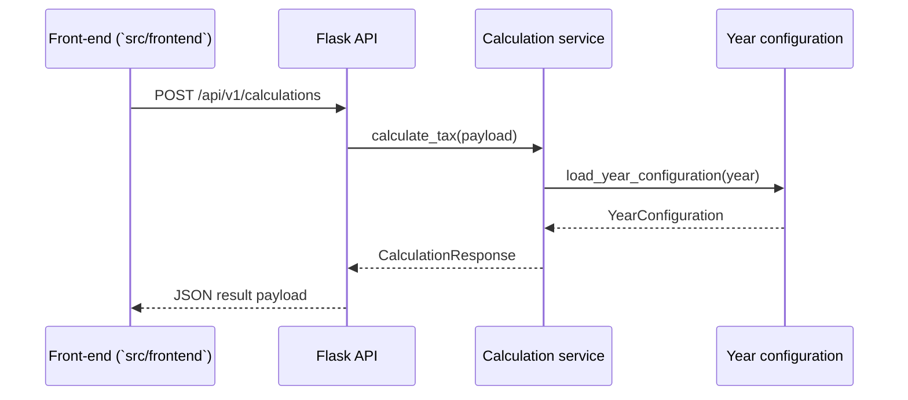

# Architecture Overview

This document is the canonical source for system architecture and module boundaries.

GreekTax is split into an API service that performs all tax logic and a static front-end shell that consumes the published endpoints. Both surfaces share configuration and translation assets stored in the repository.

## Deployment Topology

| Environment | Hosted components | Notes |
| --- | --- | --- |
| Local development | Flask API (`src/greektax/backend`) + static shell (`src/frontend`) via [`create_app`](../src/greektax/backend/app/__init__.py). | `flask --app greektax.backend.app` runs API and local UI together. |
| Staging | WSGI-hosted API + separately deployed static assets. | Uses committed config and translation snapshots for parity with production. |
| Production | Managed WSGI API + CDN/object-storage static assets. | Reverse proxy routes `/api/*` to Flask and caches `/assets/*`. |

## Module Boundaries

### Backend (`src/greektax/backend`)

- Route blueprints in `app/routes/*` expose calculations, configuration, and translations.
- `app/services/calculation_service.py` orchestrates calculators and year-specific rules.
- `config/year_config.py` loads typed YAML configuration from `config/data/*.yaml`.
- `app/models/api.py` defines API request/response contracts.

### Front-end (`src/frontend`)

- `index.html` bootstraps the static calculator shell.
- `assets/scripts/main.js` resolves API base URL and performs endpoint calls.
- `assets/scripts/translations.generated.js` embeds UI copy generated from shared catalogues.

## Request/Data Flow

```mermaid
sequenceDiagram
    participant UI as Front-end (`src/frontend`)
    participant API as Flask API
    participant Service as Calculation service
    participant Config as Year configuration

    UI->>API: POST /api/v1/calculations
    API->>Service: calculate_tax(payload)
    Service->>Config: load_year_configuration(year)
    Config-->>Service: YearConfiguration
    Service-->>API: CalculationResponse
    API-->>UI: JSON result payload
```

## Canonical workflow ownership

Architecture documentation intentionally describes structure and boundaries only.
For operational procedures, use canonical workflow docs:

- i18n updates and translation regeneration: [`docs/i18n.md`](i18n.md)
- performance capture and profiling process: [`docs/performance_baseline.md`](performance_baseline.md)
- recurring operational task index: [`docs/operations.md`](operations.md)
