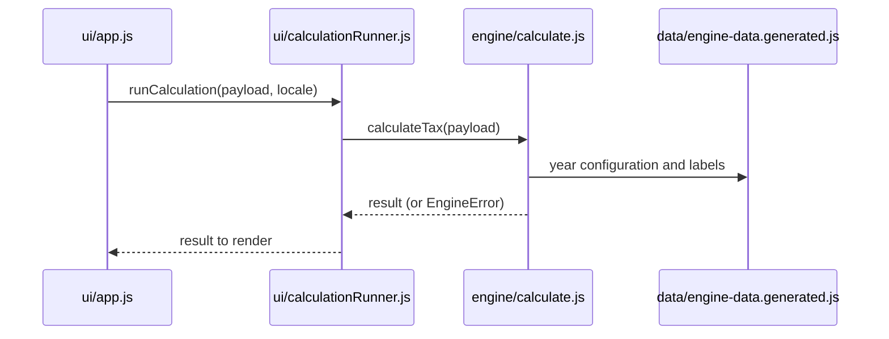

# Architecture Overview

This document is the canonical source for system architecture and module boundaries.

GreekTax is a static site. The browser loads the calculator, its configuration and its translations as static files and runs every calculation locally; nothing is sent to a server. The Python package in `src/greektax/` is not deployed: it holds the year configuration and the reference implementation of the calculation engine, from which the site's data files and the engine's test fixtures are built.

## Deployment Topology

| Environment | Hosted components | Notes |
| --- | --- | --- |
| Local development | `src/frontend` served by any static file server, e.g. `python -m http.server --directory src/frontend`. | JavaScript modules do not load from `file://`. |
| Production | `src/frontend` copied to the cPanel docroot by `.cpanel.yml`. | `scripts/configure_frontend.py` adds `?v=<hash>` to every local script so browsers never use stale files. |

## Module Boundaries

### Front-end (`src/frontend`)

- `index.html` bootstraps the static calculator shell; `assets/scripts/main.js` starts `ui/app.js`.
- `assets/scripts/translations.generated.js` embeds UI copy generated from the shared catalogues (`scripts/embed_translations.py`).
- `assets/scripts/data/client-config.generated.js` holds the year metadata, investment categories and deduction hints the UI needs; `data/engine-data.generated.js` holds each year's parsed configuration and the result labels used by the engine. Both are built by `scripts/build_client_config.py`.
- `assets/scripts/engine/` is the calculation engine: `calculateTax(payload)` returns the result the UI renders, or throws an `EngineError` with the message to show. `ui/calculationRunner.js` loads it once the page is idle and runs it.

### Reference engine and configuration (`src/greektax`)

- `backend/config/data/*.yaml` are the year files (rates, brackets, credits, contributions and the year-specific `rules`); `backend/config/year_config.py` loads and validates them, and `backend/config/client_payloads.py` shapes them for the UI.
- `backend/app/services/calculation_service.py` and `app/services/calculators/` are the reference engine; `app/models/api.py` defines and validates its input.
- `backend/app/localization/` and `translations/*.json` are the label catalogues.

### How the two engines stay identical

`scripts/generate_parity_fixtures.py` runs the Python engine on a grid of payloads and records the results in `tests/data/parity/`. `tests/frontend/engineParity.test.js` requires the JavaScript engine to reproduce every result exactly, and `pytest` fails if the fixtures or the bundled data are out of date. A rule change that is not purely YAML must therefore be made in both engines.

## Calculation flow

```mermaid
sequenceDiagram
    participant UI as ui/app.js
    participant Runner as ui/calculationRunner.js
    participant Engine as engine/calculate.js
    participant Data as data/engine-data.generated.js

    UI->>Runner: runCalculation(payload, locale)
    Runner->>Engine: calculateTax(payload)
    Engine->>Data: year configuration and labels
    Engine-->>Runner: result (or EngineError)
    Runner-->>UI: result to render
```

## Canonical workflow ownership

Architecture documentation intentionally describes structure and boundaries only.
For operational procedures, use canonical workflow docs:

- i18n updates and translation regeneration: [`docs/i18n.md`](i18n.md)
- performance capture and profiling process: [`docs/performance_baseline.md`](performance_baseline.md)
- recurring operational task index: [`docs/operations.md`](operations.md)
